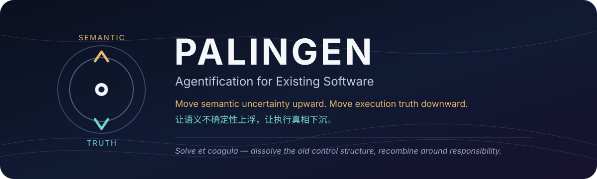
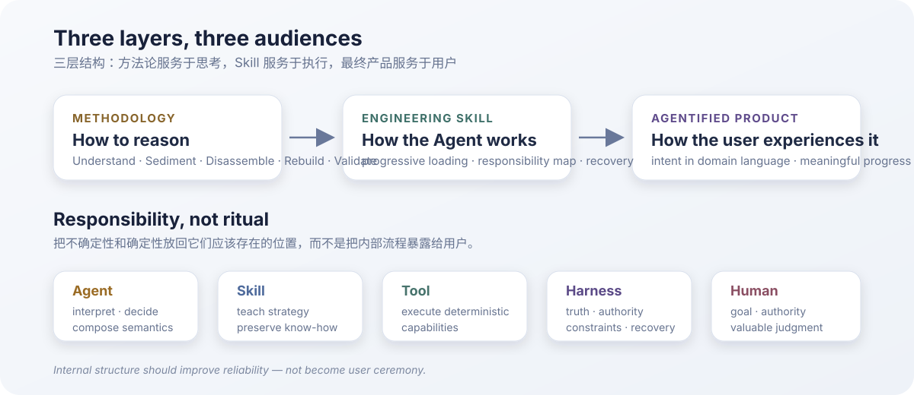

<p align="center">
  
</p>

<p align="center">
  <strong>Agentification for Existing Software · 面向既有软件的 Agent 化再生</strong><br/>
  <sub>Methodology · Engineering Skill · Agentified Product</sub>
</p>

<p align="center">
  <a href="#english">English</a> ·
  <a href="#中文">中文</a> ·
  <a href="skills/palingen/SKILL.md">Start with the Skill</a> ·
  <a href="docs/AGENTIFICATION.md">Methodology</a> ·
  <a href="docs/MOTIVATION.md">Why Palingen</a>
</p>

---

> **Move semantic uncertainty upward to the Agent; move execution truth downward into the Harness.**  
> **让语义不确定性上浮给 Agent，让执行真相下沉到 Harness。**

Palingen is not another workflow engine or LLM SDK. It is a lightweight methodology and engineering Skill for **regenerating existing software around responsibility**: keep deterministic capability deterministic, let Agents own contextual semantic composition, keep truth and authority stable, and remove non-goal operational work from humans.

Palingen 不是另一个工作流引擎，也不是 LLM SDK。它关注的是：**重新分配既有软件中的责任**——确定性的能力继续确定性执行，语义判断和动态组合交给 Agent，真相与权限保持稳定，人类不再承担无意义的胶水工作。

<p align="center">
  
</p>

---

<a id="english"></a>

# English

## Why Palingen?

Existing software often accumulates the same kinds of friction:

- humans jump between unrelated CLI / Web / API / IDE surfaces;
- fixed code has to parse ambiguous or changing semantic output;
- every LLM-enabled application rebuilds provider, streaming, schema, retry, and parsing glue;
- long workflows hide useful intermediate results behind one final `SUCCESS / FAILED` state;
- users become the real orchestrator — copying, interpreting, retrying, approving, and deciding what happens next.

Palingen starts from a simple inversion:

```text
Traditional
Application -> integrates LLM -> encodes workflow

Agentified
Human -> Agent -> composes applications / capabilities
                  while Harness preserves truth and authority
```

> **One attention surface, many execution surfaces.**

The Agent should absorb semantic coordination. The human should spend attention on intent, authority, correction, and valuable judgment — not interface plumbing.

## What changes?

Palingen separates responsibilities instead of rewriting everything:

| Responsibility | Preferred owner |
|---|---|
| Interpret ambiguous meaning | **Agent** |
| Decide context-dependent next action | **Agent** |
| Teach reusable strategy and domain know-how | **Skill** |
| Execute deterministic operations | **Tool / Code** |
| Preserve truth, constraints, permission, evidence, recovery | **Harness** |
| Own goals, authority, and high-value judgment | **Human** |

A useful diagnostic is:

```text
What does the code DO?
What does the code DECIDE?
```

The first often remains capability. The second is where responsibility may need to move.

## Workflow is not the enemy

Palingen does **not** try to eliminate every workflow.

A deterministic workflow may remain intact when its ordering is intrinsically meaningful — for example a transaction, compiler pipeline, protocol handshake, deployment sequence, or stable scan pipeline. It can be exposed as one coarse capability.

Palingen challenges **accidental orchestration**: sequencing that exists mainly because old software had to pre-encode semantic decisions that should remain contextual.

> **Keep required workflow. Remove unnecessary workflow ownership.**

## The Palingen method

Palingen v1 uses five reasoning scopes:

```text
Gate 0
  |
  +-- ordinary refactoring is enough -> stop
  |
  v
Understand
  v
Sediment <--> Disassemble
  v
Rebuild
  v
Validate
```

They are reasoning and checkpoint scopes, **not a user-facing wizard**.

- **Understand** — discover control, state, semantic decisions, side effects, artifacts, and human glue.
- **Sediment** — identify what must remain true, deterministic, authorized, and recoverable.
- **Disassemble** — separate capability, knowledge, semantic decisions, glue, authority, and obsolete control structure.
- **Rebuild** — migrate the smallest valuable responsibility slices while preserving stable capability.
- **Validate** — verify that the system became easier to adapt and operate without sacrificing reliability or interaction quality.

The primary living analytical artifact is the **Responsibility Map**. Other maps and reports are optional views, created only when information truly needs to survive a context, review, execution, or reuse boundary.

## Long-running work without a workflow engine

Long Agent work can cross context windows, login changes, tool failures, or human intervention. Palingen therefore allows a tiny run-state **whiteboard** that remembers only enough to resume:

```text
target
current boundary / focus
accepted progress
blocker or human request
last useful checkpoint
next intended direction
```

> **Whiteboard remembers the run; it does not own the run.**

No mandatory task manager, event store, DAG, or Palingen runtime is required.

## Human interaction

The default posture is **autonomous + reviewable**:

- ordinary bounded decisions continue without approval spam;
- meaningful progress is visible when something important changes;
- users can inspect, pause, correct, redirect, branch, skip, or resume;
- blocking questions are reserved for real authority, irreversibility, important evidence gaps, or human-only capability.

The resulting product should speak the **user's domain language**, not Palingen's internal vocabulary.

```text
Good:
"I need you to log in again before I can continue."

Bad:
"Human Executor required at BLOCKING intervention point."
```

> **Internal structure should improve reliability — not become user ceremony.**

## Optional domain semantic seeding

Palingen can optionally preserve business concepts, terminology, rules, states, relationships, aliases, and provenance for future cross-project semantic alignment.

```text
Project vocabulary
      ↓
Domain Semantic Seed
      ↓ repeated projects
Shared Domain Ontology
      ↓ only if justified
OWL / SHACL / reasoning
```

This is experimental, defaults to **off**, and never blocks normal Agentification. Palingen v1 does not require ontology tooling.

## Use Palingen

For a coding Agent, point it at the root Skill:

```text
Read skills/palingen/SKILL.md and use Palingen to Agentify this repository.
```

Optionally:

```text
Also enable domain semantic seeding for future cross-project ontology alignment.
```

The Agent should not ask you to restate Palingen's own goal or configure the five internal stages.

### Repository map

```text
skills/palingen/SKILL.md
    Root control frame / constitution

skills/palingen/stages/
    Current reasoning scopes

skills/palingen/references/
    Specialized decision knowledge, loaded on demand

docs/
    Motivation, methodology overview, research, known weaknesses

experimental/ontology/
    Non-authoritative ontology experiments
```

## What Palingen is not

Palingen v1 is not:

- a workflow DAG engine;
- an LLM provider SDK;
- a universal Agent runtime;
- a mandatory MCP layer;
- a fixed Event Store / State Store architecture;
- a reason to rewrite stable deterministic software;
- a requirement to model every project with an ontology;
- a chat UI wrapped around the same old approval-heavy workflow.

---

<a id="中文"></a>

# 中文

## 为什么需要 Palingen？

很多既有软件真正让人疲惫的，不是“功能做不到”，而是**人类一直在替软件做语义编排和胶水工作**：

- CLI、Web、API、IDE 来回切换；
- 人工复制结果、解释异常、判断下一步；
- 为每一个 LLM 应用重新实现 provider、流式接口、schema、parser、retry；
- 固定 workflow 把大量中间结果藏在内部，最后只留下 `SUCCESS / FAILED`；
- 一个局部步骤失败，就把整个长程任务判成失败；
- 所谓自动化最后把人变成“点确认、看日志、重新执行”的操作员。

Palingen 希望反过来：

```text
传统方式
应用 -> 集成 LLM -> 预编码流程 -> 人来补语义

Palingen
人 -> Agent -> 动态组合应用 / 能力
             Harness 保留真相、权限与恢复边界
```

> **一个注意力入口，多种执行表面。**  
> **One attention surface, many execution surfaces.**

Agent 吸收语义协调和跨工具组合，人类只在目标、授权、纠正和真正有价值的判断上投入注意力。

## Palingen 到底在“活化”什么？

不是把代码都改成 Prompt，而是重新分配责任：

| 责任 | 更适合的归属 |
|---|---|
| 理解模糊语义 | **Agent** |
| 根据上下文决定下一步 | **Agent** |
| 可复用策略与领域经验 | **Skill** |
| 确定性执行能力 | **Tool / Code** |
| 真相、约束、权限、证据、恢复 | **Harness** |
| 目标、权力、高价值判断 | **Human** |

最有用的两个问题是：

```text
代码在做什么？
代码在决定什么？
```

“做什么”往往可以继续作为稳定能力；“决定什么”才是 Agentification 最值得重新分配的地方。

## Palingen 不反对 Workflow

**Workflow 本身不是问题。**

如果顺序本身就是正确性的一部分，例如事务提交、编译流水线、协议握手、部署流程、稳定扫描流程，那么它完全可以保留在一个粗粒度 Tool 内部。

Palingen 真正挑战的是：

> 旧软件为了预编码语义判断而形成的、并非业务本质所要求的固定编排。

所以我们区分：

```text
Required Workflow
顺序本身有业务 / 正确性 / 安全意义 -> 保留

Accidental Workflow
只是旧软件为了提前写死编排而存在 -> 重新审视
```

> **不是消灭 workflow，而是把 workflow 放回它应该存在的层。**

## 五个方法论作用域

```text
Gate 0
  |
  +-- 普通重构已经足够 -> 停止 Agentification
  |
  v
Understand
  v
Sediment <--> Disassemble
  v
Rebuild
  v
Validate
```

它们是 **Agent 内部的推理作用域和检查点**，不是要求用户一步步点击的向导。

- **Understand**：理解控制流、状态、语义判断、副作用、中间产物与人工胶水。
- **Sediment**：确定即使 Agent 判断错了，哪些真相、约束、权限仍必须保持正确。
- **Disassemble**：区分能力、知识、语义决策、Glue、权限和应删除的旧控制结构。
- **Rebuild**：以最小有价值责任切片进行重建，尽量保留成熟确定性能力。
- **Validate**：确认新的责任结构真的降低了适配和使用成本，而不是只换了一种架构外观。

长期维护的核心分析脊柱是 **Responsibility Map**。其他 Harness Map、Skill Map、Glue Map、Slice Plan 或报告都只是按需视图，不应该机械地产生。

## 长程任务与极简状态白板

长程 Agent 任务可能跨会话、上下文窗口、登录态变化、工具故障和人工操作。Palingen 因此允许一个极小的运行状态白板，只保存恢复真正需要的信息：

```text
目标项目
当前边界 / 当前关注点
已经确认的进展
blocker / 人工请求
最后有效 checkpoint
下一步意图
```

> **Whiteboard remembers the run; it does not own the run.**  
> **白板记住任务，但不拥有任务流程。**

Palingen 不要求 Task Manager、DAG、Event Store 或专用 Runtime。

## 人机交互应该是什么样？

默认姿态是 **Autonomous + Reviewable（自主推进 + 可检查覆盖）**：

- 普通、可恢复的小决策由 Agent 自己推进；
- 只有发生真正有意义的变化时才主动汇报；
- 人可以查看、暂停、补充说明、纠正、改变方向、跳过、分支和恢复；
- 只有权限、不可逆操作、高影响证据缺失或必须人工完成的动作才阻塞。

最终活化出来的产品应该说**用户自己的业务语言**，而不是要求用户学习 Palingen 术语。

```text
好：
"登录状态已经失效，需要你重新登录一次，我会从当前进度继续。"

不好：
"当前进入 WAITING_FOR_HUMAN，Human Executor 为 BLOCKING。"
```

> **内部结构是为了提高可靠性，不应该变成用户仪式。**

如果一个所谓 Agent 化产品仍然要求用户选择 Tool、点击每一步 Approve、判断 retry、理解内部 state、手动推进 stage，那么它很可能只是：

> **给旧 workflow 换了一层 Chat UI。**

## 可选：业务语义种子

Palingen 可以在启动时可选地保存项目里的业务概念、术语、规则、状态、关系、别名和来源证据，为未来多个项目之间的语义对齐留下一颗种子：

```text
项目本地词汇
    ↓
Domain Semantic Seed
    ↓ 多项目积累
Shared Domain Ontology
    ↓ 确实值得时
OWL / SHACL / 推理
```

这个功能属于实验能力，**默认关闭**，不会阻塞正常 Agentification，也不会要求用户理解本体论工具。

核心原则：

> **保留项目自己的语言，逐步对齐共享语义。**

## 怎么开始？

把仓库交给支持工具调用的 Coding Agent，并告诉它：

```text
读取 skills/palingen/SKILL.md，使用 Palingen 活化当前项目。
```

如果你希望同时做业务语义沉淀，可以额外说：

```text
同时开启 Domain Semantic Seeding，保留未来跨项目本体对齐所需的业务语义。
```

正常情况下，Palingen 不应该再让你重新定义“目标是什么”，也不应该要求你配置五个内部阶段。

### 仓库结构

```text
skills/palingen/SKILL.md
    Root Skill / 宪法级控制帧

skills/palingen/stages/
    当前阶段推理指导

skills/palingen/references/
    按问题加载的专业判断知识

docs/
    动机、方法总览、研究方向、已知弱点

experimental/ontology/
    非权威的本体论实验区
```

## Palingen v1 不是什么

它不是：

- Workflow DAG 引擎；
- LLM Provider SDK；
- 通用 Agent Runtime；
- 强制 MCP 层；
- 固定 Event Store / State Store 架构；
- 为了架构纯洁而重写成熟代码的理由；
- 要求每个项目都建立本体的框架；
- 把原来的工作流换成 Chat，然后让用户继续一步步点确认的系统。

---

## Philosophy · 哲学

Palingen 取意于 **palingenesis — rebirth / 再生**。

> **Solve et coagula — dissolve, then recombine.**

不是先发明一个新框架，再强迫旧软件迁入；而是先理解旧系统为什么成立，再拆开责任，把确定性、语义、知识、权限和人类判断重新放到更合适的位置，然后以最小必要改动重新组合。

Palingen does not seek maximum autonomy or architectural purity. It seeks **better responsibility placement**.

Palingen 不追求最大自治，也不追求架构纯洁；它追求的是：

> **让正确的责任，回到正确的层。**

---

## Status · 当前状态

`v1 methodology complete` · `field validation in progress`

The next step is not to invent more concepts. It is to run Palingen on materially different real projects, observe where humans and Agents still experience friction, and let evidence drive v1.1.

下一步不是继续发明概念，而是用真实项目试跑 Palingen：观察 Agent 在哪里漂移、用户在哪里烦躁、哪些边界仍然错误，再让真实证据驱动 v1.1。